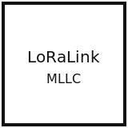

<div align="center">
  
  <h1>LoRaLink-MLLC</h1>
  <p><strong>간섭 및 손실 환경에서 LoRa UART 링크를 위한 ML 기반 손실 압축 실험 스캐폴드.</strong></p>

  <p>
    
    
    
    
    
    
    
  </p>

  <p><a href="README.md">README</a></p>
</div>

## TL;DR
- LoRa UART 페이로드 실험 스캐폴드. 플러그형 코덱, mock 링크, JSONL 로깅 포함.
- 제약: AUX 없음 -> ToA 추정, 패킷 형식 고정 `LEN|SEQ|PAYLOAD`, `max_payload_bytes` 제한.
- RAW baseline 코덱: `sensor12_packed` (바이너리 on-air 포맷; gps float32 + IMU/rpy int16 fixed-point).
- LATENT 코덱: 코덱 인터페이스 사용 (zlib 예시, BAM 추론 layer_npz_v1).
- Quickstart는 in-repo 설정으로 mock Phase 0/1과 metrics를 실행.

## 실측 대상 센서
- GPS: 위도, 경도, 고도
- 가속도계: ax, ay, az
- 자이로스코프: gx, gy, gz
- 자세 각도: roll, pitch, yaw

## 하드웨어 기준
- E22-900T22S (SX1262 core) 2개
- UART 링크, AUX 없음 -> ToA 추정

## 핵심 요구조건과 접근
- 요구조건: 페이로드 크기를 줄이면서 정보량을 보존.
- 접근: multi-layer BAM이 센서 패턴을 학습해 잠재 벡터로 압축.
- 가설: 페이로드 감소가 간섭 및 손실 환경에서 PDR 개선으로 이어질 수 있다. 실측으로 검증 필요.
- 평가: PDR/ETX, 재구성 오차 (MAE/MSE), 에너지 지표.

## Architecture at a glance
```mermaid
flowchart LR
  subgraph TX[TX node]
    Sensor[Sensor window] --> Pre[Preprocess / normalize]
    Pre --> Encode[Codec: RAW | Zlib | BAM*]
    Encode --> Packetize[Packetize LEN|SEQ|PAYLOAD]
    Packetize --> UART_TX[UART -> E22]
    UART_TX --> LogTX[JSONL log]
  end

  UART_TX --> Air[LoRa air link]

  subgraph RX[RX node]
    Air --> UART_RX[UART <- E22]
    UART_RX --> Parse[Parse frame]
    Parse --> Decode[Decode / reconstruct]
    Decode --> LogRX[JSONL log]
  end

  subgraph Offline[Offline training loop]
    Data[OTA dataset] --> Train[Train BAM-family model]
    Train --> Artifacts[Artifacts: model + norm + schema]
  end

  Artifacts -.-> Encode
  Artifacts -.-> Decode
```

*BAM 코덱은 외부 아티팩트로 추론만 지원하며 UART 드라이버는 최소 전송 계층이다.

## What's in this repo
```
.
|-- configs/
|   |-- examples/
|-- docs/
|   |-- assets/
|   `-- papers/
|-- loralink_mllc/
|-- scripts/
|-- src/
|-- tests/
|-- pyproject.toml
|-- README.md
`-- README.ko.md
```

- `configs/examples/`에는 YAML RunSpec 템플릿과 JSON legacy 템플릿이 포함된다.
- `docs/`에는 설계 문서, 프로토콜/PHY 참고 문서, 논문 해부 문서가 포함된다.
- `loralink_mllc/`는 런타임 패키지이며 코덱, 프로토콜, 라디오, 실험 코드가 있다.
- `scripts/`에는 Phase 2/3/4 보조 도구(학습/평가/리포트/플롯/검증/패키징)와 E22 설정 도구가 있다.
- `src/`는 로컬 editable install 과정에서 생성되는 메타데이터(예: `*.egg-info`)가 들어갈 수 있으며 gitignore 대상이다.

## Quickstart (First Success)
사전 조건: Python 3.10+. repo root에서 실행.

이 quickstart는 mock 링크로 패킷화, 로깅, metrics를 검증한다. 하드웨어가 필요 없다.

1) Phase 0 (C50 sweep, mock)
```bash
python -m loralink_mllc.cli phase0 --sweep configs/examples/sweep.json --out out/c50.json
```

2) Phase 1 (A/B at C50, mock)
```bash
python -m loralink_mllc.cli phase1 --c50 out/c50.json --raw configs/examples/raw.json --latent configs/examples/latent.json --out out/report.json
```

3) Metrics from logs (example)
```bash
python -m loralink_mllc.cli metrics --log out/phase1/*_tx.jsonl --out out/phase1/metrics.json
```

Outputs:
- `out/c50.json` 선택된 C50 프로파일 (mock)
- `out/report.json` Phase 1 결과 요약 (raw vs latent)
- `out/phase0/` 및 `out/phase1/` JSONL 로그
- `out/phase1/metrics.json` metrics 요약 (run_id 단위)

UART 실측용 런타임 템플릿:
- YAML: `configs/examples/tx_raw.yaml`, `configs/examples/rx_raw.yaml`
- LATENT: `configs/examples/tx_latent.yaml`, `configs/examples/rx_latent.yaml`
- BAM: `configs/examples/tx_bam.yaml`, `configs/examples/rx_bam.yaml`
- JSON legacy: `configs/examples/tx.json`, `configs/examples/rx.json`
- 매니페스트: `configs/examples/artifacts_sensor12_packed.json`(RAW baseline), `configs/examples/artifacts.json`(legacy raw:int16), `configs/examples/artifacts_zlib.json`
- 센서 샘플: `configs/examples/sensor_sample.jsonl`, `configs/examples/sensor_sample.csv`

윈도우 크기, 코덱, 재전송 설정은 `configs/examples/`에서 수정한다.

## 센서 입력 (JSONL/CSV)
JSONL/CSV 입력을 사용해 TX를 구동한다.
```bash
python -m loralink_mllc.cli tx \
  --runspec configs/examples/tx_raw.yaml \
  --manifest configs/examples/artifacts_sensor12_packed.json \
  --sampler jsonl \
  --sensor-path configs/examples/sensor_sample.jsonl \
  --dataset-out out/dataset_raw.jsonl \
  --radio mock
```
스키마는 `docs/sensing_pipeline.md` 참고. gyro는 deg/s, roll/pitch/yaw는 degrees로 고정.
시리얼 캡처 도구: `scripts/capture_serial_jsonl.py` (`pyserial` 필요).

하드웨어 모드 (부분 지원): `loralink_mllc/radio/uart_e22.py`는 최소 UART 전송만 제공한다.
UART 스트림이 `LEN|SEQ|PAYLOAD` 프레임만 전달한다고 가정하며 모듈 설정은 수행하지 않는다.
UART 모드 설치:
```bash
python -m pip install -e .[uart]
```

BAM 추론 설치:
```bash
python -m pip install -e .[bam]
```

결과 플롯(선택):
```bash
python -m pip install -e .[viz]
python scripts/plot_phase_results.py --phase3 out/phase3/report_all.json --out-dir out/plots --plots
```

BAM toy 모델 (선택):
```bash
python scripts/make_bam_identity.py --manifest configs/examples/bam_manifest.json
python -m loralink_mllc.cli tx --runspec configs/examples/tx_bam.yaml --manifest configs/examples/artifacts_bam.json --radio mock
python -m loralink_mllc.cli rx --runspec configs/examples/rx_bam.yaml --manifest configs/examples/artifacts_bam.json --radio mock
```
이 모델은 학습된 BAM이 아니라 toy identity/truncation 모델이다.

## 프로토콜 및 코덱 요약
- 애플리케이션 프레임: `LEN|SEQ|PAYLOAD`, ACK payload는 1 byte이며 `SEQ`를 echo한다.
- `max_payload_bytes`는 RunSpec에서 강제된다. 기본값은 E22 UART 제한을 반영한다.
- RAW baseline 코덱: `sensor12_packed` (gps float32 + IMU/rpy int16 fixed-point).
- Legacy RAW 코덱: int16 little-endian, scale 32767 (`loralink_mllc/codecs/raw.py`).
- BAM 코덱: numpy와 BAM 매니페스트가 필요하다 (`docs/bam_codec_artifacts.md`).

## Documentation map
- CLI 시작 가이드: `START_HERE.md`
- 설계 문서 및 실험 계획: `docs/01_design_doc_experiment_plan.md`
- 패킷 형식: `docs/protocol_packet_format.md`
- 라디오 제약 (E22 UART): `docs/radio_constraints_e22.md`
- ToA 추정 정책: `docs/toa_estimation.md`
- ADR-CODE PHY 프로파일: `docs/phy_profiles_adr_code.md`
- ADR-CODE YAML 테이블: `configs/examples/phy_profiles.yaml`
- 실험 기본값: `configs/examples/experiment_defaults.yaml`
- 지표 정의: `docs/metrics_definition.md`
- 재현성 체크리스트: `docs/reproducibility.md`
- BAM 코덱 아티팩트: `docs/bam_codec_artifacts.md`
- 센서 파이프라인: `docs/sensing_pipeline.md`
- UART + 센서 런북: `docs/runbook_uart_sensing.md`
- Phase 0 C50 필드 런북: `docs/phase0_c50_field.md`
- C50 기록 템플릿: `configs/examples/c50_record.yaml`
- UART record template: `configs/examples/uart_record.yaml`
- Phase 1 dataset runbook: `docs/phase1_dataset_collection.md`
- Phase 1 record template: `configs/examples/phase1_record.yaml`
- Phase 2 BAM training runbook: `docs/phase2_bam_training.md`
- Phase 2 record template: `configs/examples/phase2_record.yaml`
- Phase 3 on-air runbook: `docs/phase3_on_air_validation.md`
- Phase 3 record template: `configs/examples/phase3_record.yaml`
- Phase 4 energy runbook: `docs/phase4_energy_evaluation.md`
- Phase 4 record template: `configs/examples/phase4_record.yaml`
- 패치 노트: `docs/patch_notes.md`
- 완료 경로 계획: `docs/project_execution_plan.md`
- 논문 해부 문서:
  - `docs/papers/02_paper_dissect__bam_lln_lossy_compression.md`
  - `docs/papers/03_paper_dissect__kosko-bam.md`
  - `docs/papers/04_paper_dissect__febam.md`
  - `docs/papers/05_paper_dissect__mf-bam.md`

## Experiment plan summary
- Phase 0: adr_code와 payload_bytes 고정, C50 (PDR 약 50%) 조건 탐색.
- Phase 1: C50 조건에서 RAW와 LATENT를 동일 조건으로 수집.
- Phase 2: BAM-family encoder/decoder를 오프라인에서 학습하고 아티팩트를 버전 관리.
- Phase 3: payload_bytes 변화에 따른 on-air PDR/ETX와 재구성 오차 평가.
- Phase 4: payload_bytes 변화에 따른 에너지 평가.

상세 요구사항과 로깅 스키마는 `docs/01_design_doc_experiment_plan.md`에 있다.

## Metrics summary
- 링크 지표: PDR (Packet Delivery Ratio), ETX (Expected Transmission Count)
- 에너지 지표: 평균 전력 또는 성공 전달당 에너지 (측정 방법 기록)
- 재구성 지표: MAE/MSE
- 목표 KPI (baseline 대비): PDR +30% 이상, ETX -20% 이상, 전력 -20% 이상

정의와 계산은 `docs/metrics_definition.md` 참고.

## Results (TBD)
아직 결과가 없다. `docs/assets/`에 플롯을 추가하고 링크한다.
- PDR 및 ETX vs payload size
- Reconstruction error vs payload size
- Energy per delivered window vs payload size

## Project status / roadmap
- [x] 패킷 형식과 ToA 추정 유틸리티 정의
- [x] mock 링크, JSONL 로그, Phase 0/1 하네스 제공
- [x] UART E22 최소 전송 구현 (모듈 설정 없음)
- [x] BAM-family 추론 코덱과 아티팩트 규약 추가
- [x] Phase 2 학습 워크플로 및 평가 스크립트 제공 (`scripts/phase2_train_bam.py`, `scripts/eval_bam_dataset.py`)
- [ ] on-air 검증 결과 공개
- [x] Apache-2.0 라이선스 적용

## License
Apache License 2.0. `LICENSE` 참고.

## Citation
`CITATION.cff`에 최소 템플릿이 있다. 배포 전 TODO 필드를 채운다.

## Contributing and contact
이슈와 PR은 환영한다. 큰 변경은 먼저 이슈로 범위를 논의해 달라.
연락은 GitHub 이슈로 진행한다.
보안 취약점 제보는 `SECURITY.md`를 참고한다.
